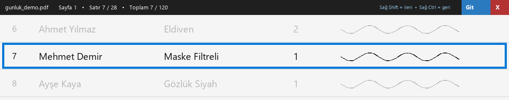

# Günlük Satır (gunluk_satir.py)

Taranan "Günlük Verilen Malzeme" PDF'ini ekranın en üstünde, fokus çalmayan
(WS_EX_NOACTIVATE) ince bir şerit olarak SATIR SATIR gösterir. Excel'de
yazmaya devam edersin; şerit hangi satırda olduğunu takip eder.

## Teknik
- Tablo satırları görüntü işlemeyle bulunur: yatay çizgi algılama (numpy),
  eksik çizgileri satır adımıyla tamamlama, kenar payı telafisi
- Eğik taramalar projeksiyon profiliyle otomatik düzeltilir (iki kademeli
  açı araması, ±8°)
- Kaldığın satır PDF başına `gunluk_satir_durum.json`'a kaydedilir;
  aynı PDF tekrar açılınca "kaldığın yerden devam?" diye sorar

## Tuşlar (global — Excel odaktayken de çalışır, pynput)
- Sağ Shift: sıradaki satır + Excel'e kayıtlı tuş dizisini gönderir (örn. ↓←←)
- Sol Shift + Sağ Shift: sıradaki satır ama Excel'e dokunmaz
- Sağ Ctrl: önceki satır
- Şerit düğmeleri: ⌨ Ayarla (tuş dizisi kaydet) · Excel ✓/✕ · ⤓ Git ·
  ✔ Bitti (dosya adına "(işlendi)" ekler) · ✕ çıkış

Ayarlar py dosyasının başındaki AYARLAR bloğunda (eşikler, ölçek, paylar).

Gereksinim: `numpy`, `pypdfium2`, `Pillow`, `pynput`
