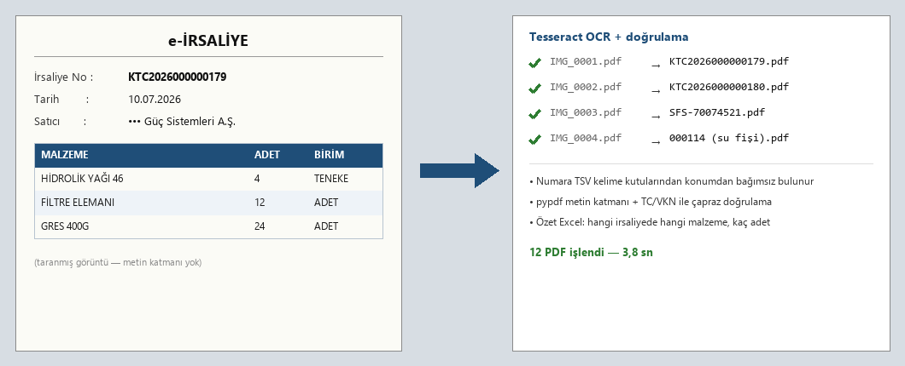

# İrsaliye İşleme (irsaliye_isle.py + su_irsaliye_isle.py)

Taranan irsaliye/fatura ve su teslim fişi PDF'lerini otomatik numaralandırıp
adlandırır. İkisi de klasör seçtirir, kuru deneme (--kuru) destekler.

## irsaliye_isle.py — irsaliye/fatura
- PDF'te metin katmanı varsa pypdf ile okur; yoksa sağ-üst bilgi kutusunu
  pypdfium2 ile render edip Tesseract OCR uygular (yanlış numara kapmasın diye
  bölge sınırlı)
- Fatura/İrsaliye No + Tarih bulur → dosyayı `<No>.pdf` yapar (çakışma korumalı)
- Özet Excel (Dosya / No / Tarih) + tüm metinleri içeren .txt döker
- `irsaliye_isle.bat` ile çift tık; onay sorar

## su_irsaliye_isle.py — su teslim fişleri
- "TESLİM FİŞİ" yanındaki 6 haneli seri numarasını Tesseract'ın TSV
  (kelime-kutusu) çıktısıyla KONUMDAN BAĞIMSIZ tespit eder
- OCR küçük rakamda yanılabildiği için her fiş için numara bölgesi BÜYÜK
  gösterilir: doğruysa Enter, yanlışsa düzelt (--otomatik ile sormadan geçer)
- Adlandırılan dosya `tarandı` alt klasörüne taşınır

Harici gereksinim: **Tesseract-OCR** (`C:\Program Files\Tesseract-OCR\tesseract.exe`)

pip: `pypdf`, `pypdfium2`, `Pillow`
