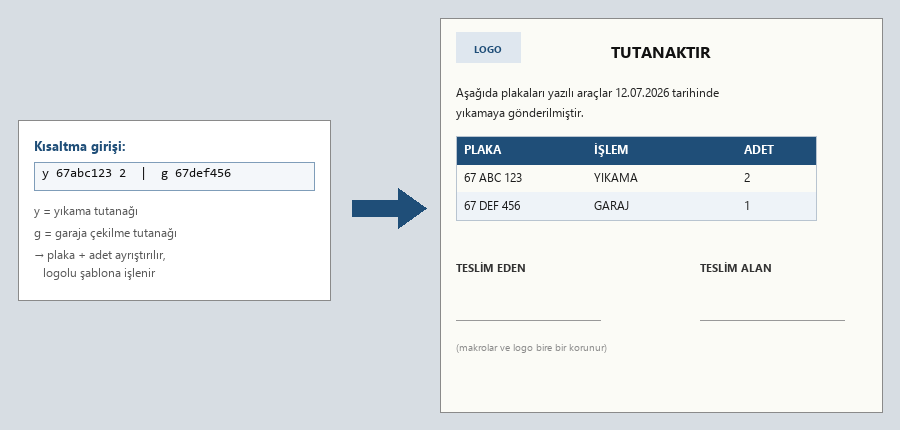

# Tutanak Üretim (tutanak_olustur.py)

Yıkamaya/garaja gönderilen kıyafetler için teslim tutanağını, kısaltma
kodlarından otomatik üretir.

## Kullanım
`python tutanak_olustur.py` → sorar:
1. Tutanak başlığı (örn. YIKAMAYA GİDECEK TUTANAĞI)
2. İmza bloğu tipi (2_imza / 3_imza — IMZA_BLOKLARI sözlüğünden genişletilebilir)
3. Kısaltma + miktarlar (örn. `pm54 1, ks 3, km 1` — tek satır veya çok satır)

Kodları çözümler, aynı malzemeleri birleştirir, sıralar ve
`YIKAMA TUTANAK FORMATI.xlsx` şablonuna (bu klasörde) yazar.

## Kısaltma sözlüğü
Kod → tam ad eşlemesi (KS → POLO YAKA SWEAT S BEDEN gibi) hem script içinde
hem `TUTANAK_URETIM_OZET.md`'de tanımlıdır. Yeni kod eklemek için ikisini de
güncelle.

## Teknik not
Şablondaki logo ve makroların bozulmaması için dosya COM/openpyxl ile yeniden
yazılmaz; zip-kopyala + sheet XML'ine inlineStr enjeksiyonu yöntemi kullanılır.

pip: standart kütüphane (+ şablon .xlsx)
