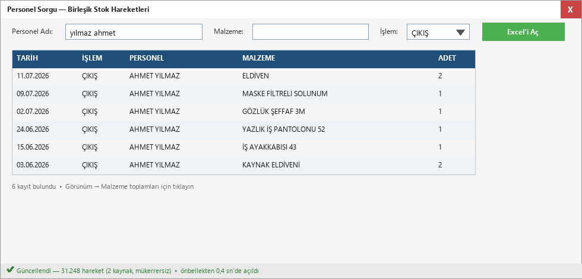
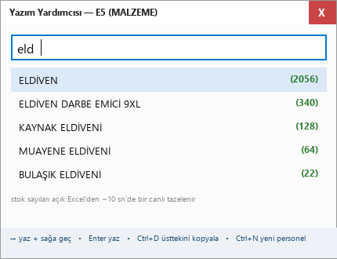
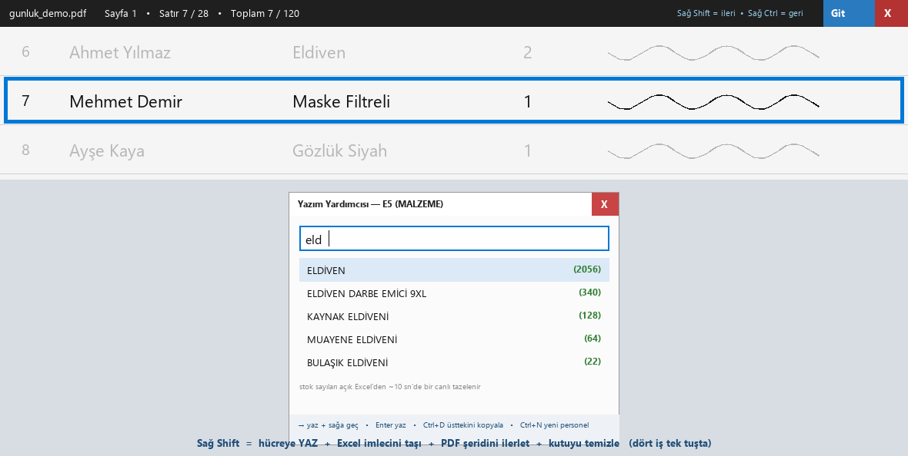
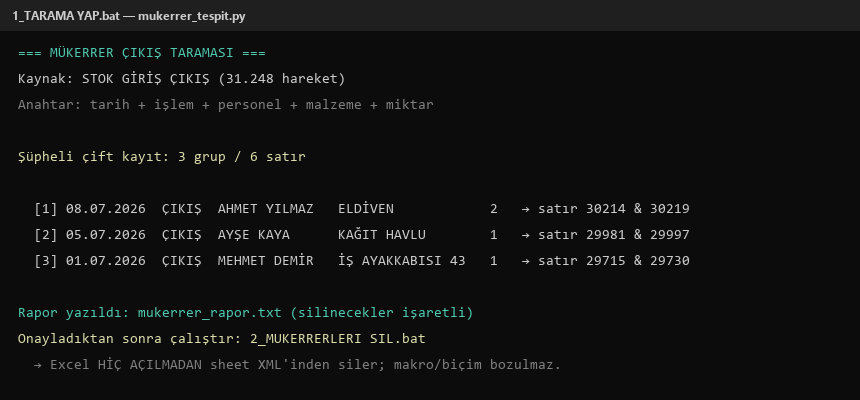
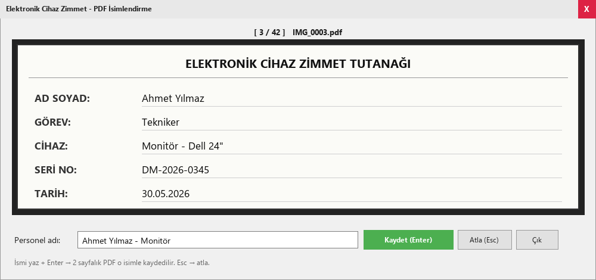
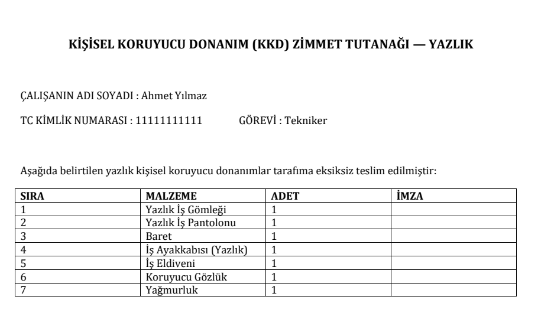
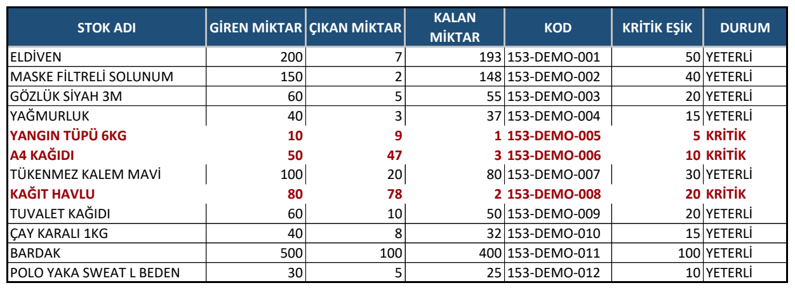
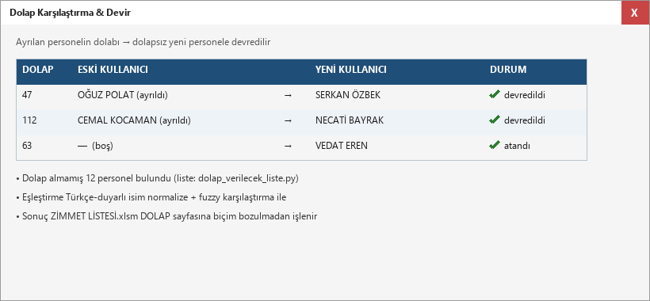
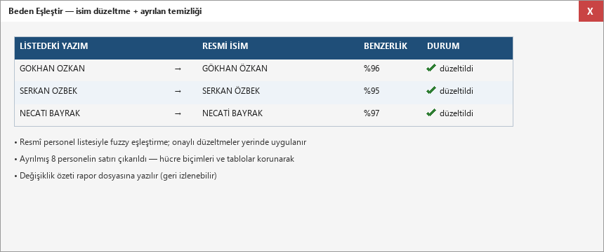

# Liman Depo Otomasyon Araçları

Liman iş makineleri deposunun günlük operasyonunu — stok takibi, malzeme
zimmeti, taranan evrak işleme, tutanak üretimi — hızlandırmak için geliştirilmiş
**Python + VBA araç seti**. Mevcut Excel düzenini söküp atmak yerine üzerine
akıllı katmanlar kurar: canlı COM entegrasyonu, OCR'li evrak işleme, global
klavye kısayolları ve fokus çalmayan yardımcı pencereler.

> Bu depo, iş yerinde **her gün aktif kullanılan** araçların yayın kopyasıdır
> (son tazeleme: 12.07.2026). Gerçek veriler dahil edilmemiştir — ayrıntı için
> aşağıdaki *Gizlilik / KVKK* bölümüne bak.

## Araçlar

| Klasör | Araç | Ne yapar |
|---|---|---|
| `01-personel-sorgu` | Personel Sorgu | İki stok Excel'ini mükerrersiz birleştirir; personel/malzeme anında sorgulanır |
| `02-yazim-yardimcisi` | Yazım Yardımcısı | Excel'e veri girerken canlı otomatik tamamlama (COM ile hücreye yazar, stok gösterir) |
| `03-gunluk-satir` | Günlük Satır | Taranan tablo PDF'ini satır satır ekran üstü şeritte gösterir (satır algılama + deskew) |
| `04-gunluk-yazim-birlesik` | Birleşik Mod | Üstteki ikisi tek süreçte; Sağ Shift = yaz + hücre taşı + PDF ilerle |
| `05-mukerrer-temizlik` | Mükerrer Temizlik | Çift girilmiş çıkışları raporlar; onaylıları Excel'i açmadan XML'den siler |
| `06-irsaliye-isleme` | İrsaliye İşleme | Taranan irsaliye/su fişlerini OCR ile numaralandırıp adlandırır, özet Excel döker |
| `07-kkd-tarama` | KKD Tarama | Taranan zimmet PDF'lerini böler, personel adıyla adlandırır, Excel girişine yardım eder |
| `08-kkd-zimmet-uretim` | Zimmet Üretim | ~700-800 personele kişiselleştirilmiş Word zimmet belgesi üretir ve teyitli yazdırır |
| `09-tutanak-uretim` | Tutanak Üretim | Kısaltma kodlarından yıkama/garaj tutanağı üretir (logo+makro korumalı) |
| `10-excel-vba` | VBA Modülleri | Excel dosyalarının içindeki makroların dışa aktarılmış yedekleri + kurulum rehberi |
| `11-excel-dosyalari` | Excel Dosyaları | Çalışan .xlsm'lerin tanıtımı — gerçek veri içerdiği için dosyalar bu depoda YOK, yalnızca açıklama README'si var |
| `12-dolap-karsilastirma` | Dolap Karşılaştırma | Dolap almamış personeli çıkarır; ayrılmış dolapları yeni kullanıcıya devreder (3 araç) |
| `13-beden-eslestir` | Beden Eşleştir | Beden listesinde isimleri düzeltir, ayrılmışların satırlarını çıkarır (biçim korumalı) |

Her klasörde kendi `README.md`'si vardır — tek bir aracı incelemek için
sadece o klasörün README'sini okumak yeterlidir.
Uçtan uca kullanım anlatımı: `KULLANIM-KILAVUZU.md`.

## Ekran görüntüleri (demo veriler)

| | |
|---|---|
| <br><sub>**01 Personel Sorgu** — iki kaynaktan mükerrersiz birleşik arama</sub> | <br><sub>**02 Yazım Yardımcısı** — canlı stok sayılı otomatik tamamlama</sub> |
| <br><sub>**03 Günlük Satır** — taranan PDF'i satır satır şeritte gösterir</sub> | <br><sub>**04 Birleşik Mod** — Sağ Shift ile dört iş tek tuşta</sub> |
| <br><sub>**05 Mükerrer Temizlik** — tespit + XML'den güvenli silme</sub> | <br><sub>**06 İrsaliye İşleme** — Tesseract OCR ile numaralandırma</sub> |
| <br><sub>**07 KKD Tarama** — taranan zimmetleri bölme/adlandırma</sub> | <br><sub>**08 Zimmet Üretim** — Excel'den ~700 kişiye Word belgesi</sub> |
| <br><sub>**09 Tutanak Üretim** — kısaltma kodundan logolu tutanak</sub> | <br><sub>**10 Excel/VBA** — canlı stok, kritik seviye uyarısı</sub> |
| <br><sub>**12 Dolap Karşılaştırma** — ayrılan dolabını devretme</sub> | <br><sub>**13 Beden Eşleştir** — fuzzy isim düzeltme, biçim korumalı</sub> |

## Öne çıkan teknikler

- **Excel COM otomasyonu** — çalışan Excel'e bağlanıp aktif hücreyi canlı izleme,
  odak çalmadan hücreye yazma, toplu aralık okuma; etkinleştirme sihirbazı
  dialoglarına karşı WM_CLOSE + yeniden deneme stratejisi
- **xlsm "ameliyatı"** — Excel hiç açılmadan ZIP içindeki sheet XML'inden satır
  silme; makrolar, butonlar ve biçimler bire bir korunur
- **OCR ve PDF işleme** — pypdf metin katmanı + TC no ile çapraz doğrulama,
  Tesseract TSV kelime kutularıyla konumdan bağımsız seri no tespiti,
  pypdfium2 ile yüksek çözünürlük render
- **Görüntü işleme** — projeksiyon profiliyle otomatik eğiklik düzeltme (deskew),
  yatay çizgi algılamayla tablo satırı çıkarımı (numpy)
- **Global klavye kancaları** — pynput/ctypes ile Excel penceresi odaktayken bile
  çalışan kısayollar; fokus çalmayan (WS_EX_NOACTIVATE) hep-üstte şeritler
- **Dayanıklılık** — atomik dosya yazma (tmp + replace), önbellek + arka plan
  tazeleme, kaynak dosyaları geçici kopyadan okuma (açık Excel'le çakışmaz)

## Kurulum (başka bilgisayarda)

1. Windows + **Microsoft Excel** kurulu olmalı — Excel'e canlı bağlanan araçlar
   için şart (yazım yardımcısı, birleşik mod, dolap atama, düzeltme uygulama
   adımları). İstisna: Personel Sorgu Excel programı olmadan da çalışır.
2. Python 3.10+ kur (araçlar 3.13 ile test edildi; kurulumda "Add python.exe
   to PATH" işaretle), sonra bu klasörde:
   ```
   pip install -r requirements.txt
   ```
3. OCR kullanan araçlar (06) için [Tesseract-OCR](https://github.com/UB-Mannheim/tesseract/wiki)
   kur — beklenen yol: `C:\Program Files\Tesseract-OCR\tesseract.exe`
   (farklı yere kurulursa PATH'te olması yeterli)
4. **Yollar esnektir:** Excel dosyasına ihtiyaç duyan araçlar önce kayıtlı
   ayara, sonra bilinen konumlara (`%USERPROFILE%\Desktop\...`) bakar;
   bulamazsa İLK ÇALIŞTIRMADA dosya seçtirir ve seçimi
   `%LOCALAPPDATA%\DepoAraclari\yollar.json`'a kaydeder — bir daha sormaz.
   Ayar dosyası araçlar arasında ortaktır (TCH dosyasını bir kez seçmek yeter).
   Yanlış dosya seçtiysen yollar.json'u silmen yeterli. Klasör işleyen araçlar
   (irsaliye, kkd) zaten her açılışta klasör seçtirir.
5. Bu arşivdeki .bat başlatıcılar bulundukları klasördeki py dosyasını çalıştırır
   (`%~dp0`) ve Python'u önce bilinen kurulum yolunda, yoksa PATH'te arar —
   klasörü nereye kopyalarsan kopyala çalışırlar.
6. `04-gunluk-yazim-birlesik` gerekli iki modülü önce kendi yanında, sonra
   arşiv kardeş klasörlerinde (02/03), sonra masaüstü düzeninde arar —
   arşiv kendi başına yeterlidir.

## Gizlilik / KVKK

- `12` ve `13` klasörlerindeki personel Excel'leri **rastgele üretilmiş
  SENTETİK örnek verilerdir** — gerçek kişilerle ilgisi yoktur, TC alanları
  bilerek geçersiz kontrol basamaklıdır (gerçek TC olamaz), telefon/IMEI/plaka
  rastgeledir. Ayrıntı: her iki klasördeki `ORNEK_VERI_BEYANI.md` ve dosyaların
  içindeki **BEYAN** sayfaları. Bu klasörler KVKK açısından paylaşıma uygundur.
- Kod klasörleri (01-10, 12, 13) kişisel veri içermez.
- **`11-excel-dosyalari`**: çalışan .xlsm'ler gerçek veri (personel adları,
  stok kayıtları) içerdiğinden **bu depoya dahil edilmemiştir** (`.gitignore`
  ile dışlanır); klasörde yalnızca dosyaları tanıtan bir README bulunur.
